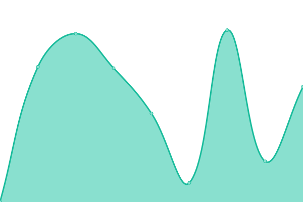
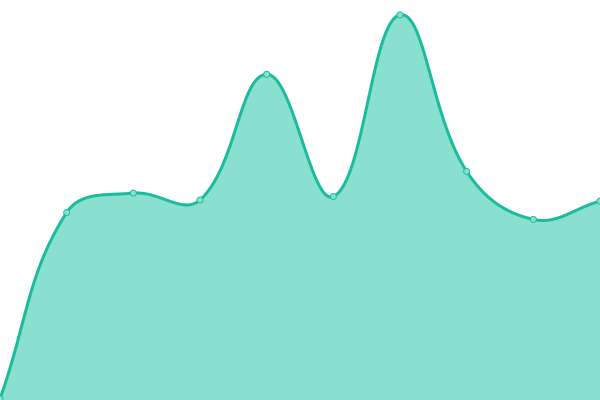
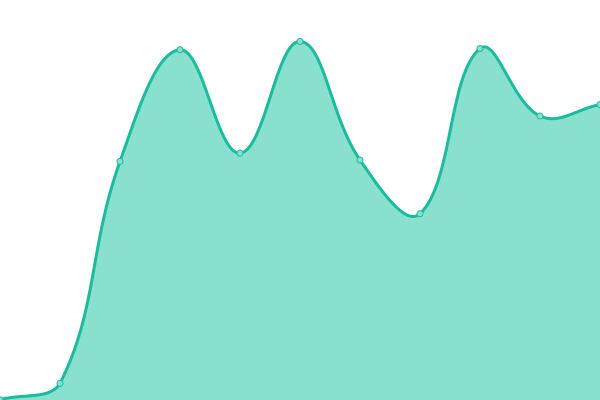
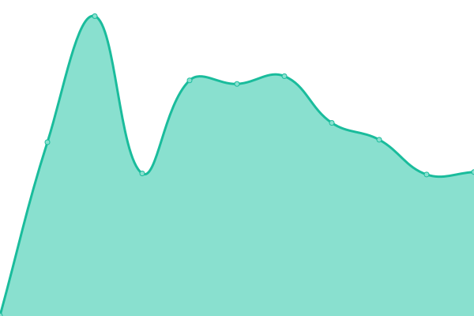
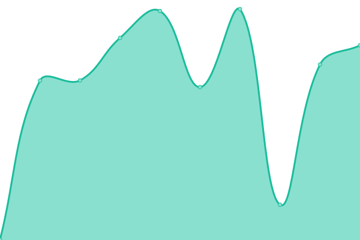
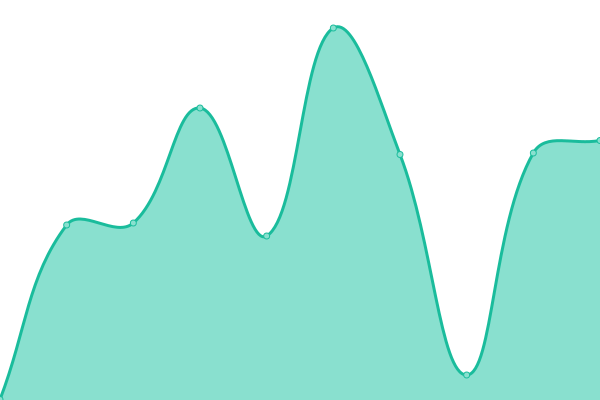
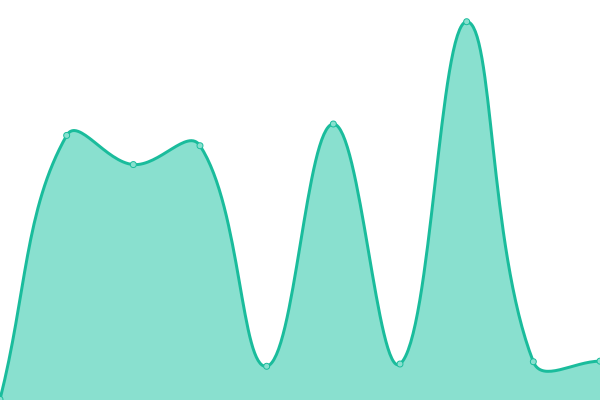
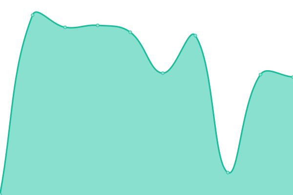

# [📈 Live Status](https://uptimes.chaotic.cx): <!--live status--> **🟧 Partial outage**

This repository contains the open-source uptime monitor and status page for [Chaotic-AUR](https://aur.chaotic.cx), powered by [Upptime](https://github.com/upptime/upptime).

Whenever downtimes are detected, a corresponding [issue](https://github.com/chaotic-aur/chaotic-uptimes/issues) is opened in which the mirror maintainer gets tagged.

<!--start: status pages-->
<!-- This summary is generated by Upptime (https://github.com/upptime/upptime) -->
<!-- Do not edit this manually, your changes will be overwritten -->
<!-- prettier-ignore -->
| URL | Status | History | Response Time | Uptime |
| --- | ------ | ------- | ------------- | ------ |
|  [Homepage](https://aur.chaotic.cx) | 🟩 Up | [homepage.yml](https://github.com/chaotic-aur/chaotic-uptimes/commits/HEAD/history/homepage.yml) | 

 225ms
     
 | 

<a href="https://uptimes.chaotic.cx/history/homepage">100.00%</a>
    

|  [The router](https://geo-mirror.chaotic.cx) | 🟩 Up | [the-router.yml](https://github.com/chaotic-aur/chaotic-uptimes/commits/HEAD/history/the-router.yml) | 

 218ms
     
 | 

<a href="https://uptimes.chaotic.cx/history/the-router">100.00%</a>
    

|  [bg (Sudoman)](https://bg-mirror.chaotic.cx/no-failover/chaotic-aur/lastupdate) | 🟩 Up | [bg-sudoman.yml](https://github.com/chaotic-aur/chaotic-uptimes/commits/HEAD/history/bg-sudoman.yml) | 

 841ms
     
 | 

<a href="https://uptimes.chaotic.cx/history/bg-sudoman">100.00%</a>
    

|  [br (UFSCar Alcateia)](https://br-mirror.chaotic.cx/no-failover/chaotic-aur/lastupdate) | 🟩 Up | [br-ufs-car-alcateia.yml](https://github.com/chaotic-aur/chaotic-uptimes/commits/HEAD/history/br-ufs-car-alcateia.yml) | 

 852ms
     
 | 

<a href="https://uptimes.chaotic.cx/history/br-ufs-car-alcateia">100.00%</a>
    

|  [br-2 (Alisson)](https://br-2-mirror.chaotic.cx/no-failover/chaotic-aur/lastupdate) | 🟩 Up | [br-2-alisson.yml](https://github.com/chaotic-aur/chaotic-uptimes/commits/HEAD/history/br-2-alisson.yml) | 

 702ms
     
 | 

<a href="https://uptimes.chaotic.cx/history/br-2-alisson">100.00%</a>
    

|  [ca (freebird54)](https://ca-mirror.chaotic.cx/no-failover/chaotic-aur/lastupdate) | 🟩 Up | [ca-freebird54.yml](https://github.com/chaotic-aur/chaotic-uptimes/commits/HEAD/history/ca-freebird54.yml) | 

 394ms
     
 | 

<a href="https://uptimes.chaotic.cx/history/ca-freebird54">100.00%</a>
    

|  [cdn (Fosshost)](https://cdn-mirror.chaotic.cx/no-failover/chaotic-aur/lastupdate) | 🟩 Up | [cdn-fosshost.yml](https://github.com/chaotic-aur/chaotic-uptimes/commits/HEAD/history/cdn-fosshost.yml) | 

 551ms
     
 | 

<a href="https://uptimes.chaotic.cx/history/cdn-fosshost">100.00%</a>
    

|  [cdn-cn (Aliyun)](https://cdn-cn-mirror.chaotic.cx/) | 🟩 Up | [cdn-cn-aliyun.yml](https://github.com/chaotic-aur/chaotic-uptimes/commits/HEAD/history/cdn-cn-aliyun.yml) | 

 221ms
     
 | 

<a href="https://uptimes.chaotic.cx/history/cdn-cn-aliyun">100.00%</a>
    

|  [de (dr460nf1r3)](https://de-mirror.chaotic.cx/no-failover/chaotic-aur/lastupdate) | 🟩 Up | [de-dr460nf1r3.yml](https://github.com/chaotic-aur/chaotic-uptimes/commits/HEAD/history/de-dr460nf1r3.yml) | 

 646ms
     
 | 

<a href="https://uptimes.chaotic.cx/history/de-dr460nf1r3">95.28%</a>
    

|  [de-2 (Bangl)](https://de-2-mirror.chaotic.cx/no-failover/chaotic-aur/lastupdate) | 🟩 Up | [de-2-bangl.yml](https://github.com/chaotic-aur/chaotic-uptimes/commits/HEAD/history/de-2-bangl.yml) | 

 1016ms
     
 | 

<a href="https://uptimes.chaotic.cx/history/de-2-bangl">100.00%</a>
    

|  [de-3 (itsTyrion)](https://de-3-mirror.chaotic.cx/no-failover/chaotic-aur/lastupdate) | 🟩 Up | [de-3-its-tyrion.yml](https://github.com/chaotic-aur/chaotic-uptimes/commits/HEAD/history/de-3-its-tyrion.yml) | 

 1098ms
     
 | 

<a href="https://uptimes.chaotic.cx/history/de-3-its-tyrion">100.00%</a>
    

|  [de-4 (redglobuli)](https://de-4-mirror.chaotic.cx/no-failover/chaotic-aur/lastupdate) | 🟩 Up | [de-4-redglobuli.yml](https://github.com/chaotic-aur/chaotic-uptimes/commits/HEAD/history/de-4-redglobuli.yml) | 

 927ms
     
 | 

<a href="https://uptimes.chaotic.cx/history/de-4-redglobuli">100.00%</a>
    

|  [es (JKA Network)](https://es-mirror.chaotic.cx/no-failover/chaotic-aur/lastupdate) | 🟩 Up | [es-jka-network.yml](https://github.com/chaotic-aur/chaotic-uptimes/commits/HEAD/history/es-jka-network.yml) | 

 679ms
     
 | 

<a href="https://uptimes.chaotic.cx/history/es-jka-network">100.00%</a>
    

|  [es-2 (Ícar)](https://es-2-mirror.chaotic.cx/no-failover/chaotic-aur/lastupdate) | 🟩 Up | [es-2-icar.yml](https://github.com/chaotic-aur/chaotic-uptimes/commits/HEAD/history/es-2-icar.yml) | 

 683ms
     
 | 

<a href="https://uptimes.chaotic.cx/history/es-2-icar">100.00%</a>
    

|  [fr (IRC Nerds))](https://fr-mirror.chaotic.cx/no-failover/chaotic-aur/lastupdate) | 🟥 Down | [fr-irc-nerds.yml](https://github.com/chaotic-aur/chaotic-uptimes/commits/HEAD/history/fr-irc-nerds.yml) | 

 536ms
     
 | 

<a href="https://uptimes.chaotic.cx/history/fr-irc-nerds">79.26%</a>
    

|  [fr-2 (Snowy)](https://fr-2-mirror.chaotic.cx/no-failover/chaotic-aur/lastupdate) | 🟩 Up | [fr-2-snowy.yml](https://github.com/chaotic-aur/chaotic-uptimes/commits/HEAD/history/fr-2-snowy.yml) | 

 556ms
     
 | 

<a href="https://uptimes.chaotic.cx/history/fr-2-snowy">100.00%</a>
    

|  [gr (vmmaniac)](https://gr-mirror.chaotic.cx/no-failover/chaotic-aur/lastupdate) | 🟩 Up | [gr-vmmaniac.yml](https://github.com/chaotic-aur/chaotic-uptimes/commits/HEAD/history/gr-vmmaniac.yml) | 

 786ms
     
 | 

<a href="https://uptimes.chaotic.cx/history/gr-vmmaniac">100.00%</a>
    

|  [in (Naman)](https://in-mirror.chaotic.cx/no-failover/chaotic-aur/lastupdate) | 🟩 Up | [in-naman.yml](https://github.com/chaotic-aur/chaotic-uptimes/commits/HEAD/history/in-naman.yml) | 

 0ms
     
 | 

<a href="https://uptimes.chaotic.cx/history/in-naman">94.47%</a>
    

|  [in-2 (Albony)](https://in-2-mirror.chaotic.cx/no-failover/chaotic-aur/lastupdate) | 🟩 Up | [in-2-albony.yml](https://github.com/chaotic-aur/chaotic-uptimes/commits/HEAD/history/in-2-albony.yml) | 

 581ms
     
 | 

<a href="https://uptimes.chaotic.cx/history/in-2-albony">98.00%</a>
    

|  [kr (silent-heigou)](https://kr-mirror.chaotic.cx/no-failover/chaotic-aur/lastupdate) | 🟩 Up | [kr-silent-heigou.yml](https://github.com/chaotic-aur/chaotic-uptimes/commits/HEAD/history/kr-silent-heigou.yml) | 

 1648ms
     
 | 

<a href="https://uptimes.chaotic.cx/history/kr-silent-heigou">92.71%</a>
    

|  [secret (Garuda)](https://secret-mirror.chaotic.cx/no-failover/chaotic-aur/lastupdate) | 🟩 Up | [secret-garuda.yml](https://github.com/chaotic-aur/chaotic-uptimes/commits/HEAD/history/secret-garuda.yml) | 

 322ms
     
 | 

<a href="https://uptimes.chaotic.cx/history/secret-garuda">97.63%</a>
    

|  [sg (Freedif)](https://sg-mirror.chaotic.cx/no-failover/chaotic-aur/lastupdate) | 🟩 Up | [sg-freedif.yml](https://github.com/chaotic-aur/chaotic-uptimes/commits/HEAD/history/sg-freedif.yml) | 

 1238ms
     
 | 

<a href="https://uptimes.chaotic.cx/history/sg-freedif">100.00%</a>
    

|  [us-fl (Alisson)](https://us-fl-mirror.chaotic.cx/no-failover/chaotic-aur/lastupdate) | 🟩 Up | [us-fl-alisson.yml](https://github.com/chaotic-aur/chaotic-uptimes/commits/HEAD/history/us-fl-alisson.yml) | 

 308ms
     
 | 

<a href="https://uptimes.chaotic.cx/history/us-fl-alisson">100.00%</a>
    

|  [us-mi (Technetium1)](https://us-mi-mirror.chaotic.cx/no-failover/chaotic-aur/lastupdate) | 🟥 Down | [us-mi-technetium1.yml](https://github.com/chaotic-aur/chaotic-uptimes/commits/HEAD/history/us-mi-technetium1.yml) | 

 332ms
     
 | 

<a href="https://uptimes.chaotic.cx/history/us-mi-technetium1">99.81%</a>
    

|  [us-tx (xstefen)](https://us-tx-mirror.chaotic.cx/no-failover/chaotic-aur/lastupdate) | 🟩 Up | [us-tx-xstefen.yml](https://github.com/chaotic-aur/chaotic-uptimes/commits/HEAD/history/us-tx-xstefen.yml) | 

 497ms
     
 | 

<a href="https://uptimes.chaotic.cx/history/us-tx-xstefen">100.00%</a>
    

|  [us-ut (Ash)](https://us-ut-mirror.chaotic.cx/no-failover/chaotic-aur/lastupdate) | 🟩 Up | [us-ut-ash.yml](https://github.com/chaotic-aur/chaotic-uptimes/commits/HEAD/history/us-ut-ash.yml) | 

 1582ms
     
 | 

<a href="https://uptimes.chaotic.cx/history/us-ut-ash">100.00%</a>
    

|  [us-va (Zoe)](https://us-ut-mirror.chaotic.cx/no-failover/chaotic-aur/lastupdate) | 🟩 Up | [us-va-zoe.yml](https://github.com/chaotic-aur/chaotic-uptimes/commits/HEAD/history/us-va-zoe.yml) | 

 1322ms
     
 | 

<a href="https://uptimes.chaotic.cx/history/us-va-zoe">100.00%</a>
    

<!--end: status pages-->

[**Visit our status website →**](https://uptimes.chaotic.cx)

## 📄 License

- Powered by: [Upptime](https://github.com/upptime/upptime)
- Code: [MIT](./LICENSE) © [Chaotic-AUR](https://aur.chaotic.cx)
- Data in the `./history` directory: [Open Database License](https://opendatacommons.org/licenses/odbl/1-0/)
