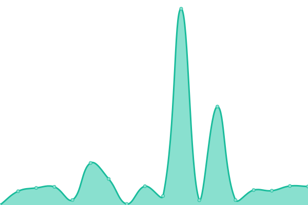
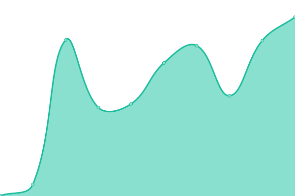
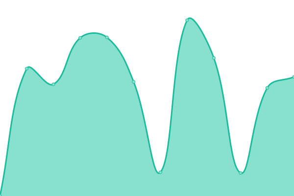
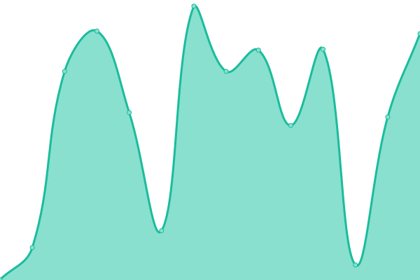
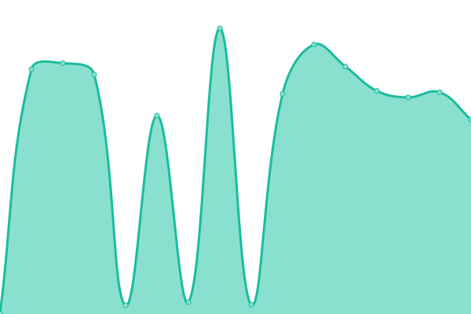

# [📈 Live Status](https://uptimes.chaotic.cx): <!--live status--> **🟧 Partial outage**

This repository contains the open-source uptime monitor and status page for [Nico](https://dr460nf1r3.org), powered by [Upptime](https://github.com/upptime/upptime).

With [Upptime](https://upptime.js.org), you can get your own unlimited and free uptime monitor and status page, powered entirely by a GitHub repository. We use [Issues](https://github.com/dr460nf1r3/chaotic-uptimes/issues) as incident reports, [Actions](https://github.com/dr460nf1r3/chaotic-uptimes/actions) as uptime monitors, and [Pages](https://uptimes.chaotic.cx) for the status page.

<!--start: status pages-->
<!-- This summary is generated by Upptime (https://github.com/upptime/upptime) -->
<!-- Do not edit this manually, your changes will be overwritten -->
<!-- prettier-ignore -->
| URL | Status | History | Response Time | Uptime |
| --- | ------ | ------- | ------------- | ------ |
|  [Homepage](https://aur.chaotic.cx) | 🟩 Up | [homepage.yml](https://github.com/chaotic-aur/chaotic-uptimes/commits/HEAD/history/homepage.yml) | 

 197ms
     
 | 

<a href="https://uptimes.chaotic.cx/history/homepage">100.00%</a>
    

|  [The router](https://geo-mirror.chaotic.cx) | 🟩 Up | [the-router.yml](https://github.com/chaotic-aur/chaotic-uptimes/commits/HEAD/history/the-router.yml) | 

 201ms
     
 | 

<a href="https://uptimes.chaotic.cx/history/the-router">100.00%</a>
    

|  [br | UFSCar Alcateia](https://br-mirror.chaotic.cx/no-failover/chaotic-aur/lastupdate) | 🟩 Up | [br-ufs-car-alcateia.yml](https://github.com/chaotic-aur/chaotic-uptimes/commits/HEAD/history/br-ufs-car-alcateia.yml) | 

 2022ms
     
 | 

<a href="https://uptimes.chaotic.cx/history/br-ufs-car-alcateia">100.00%</a>
    

|  [cdn | Fosshost](https://cdn-mirror.chaotic.cx/no-failover/chaotic-aur/lastupdate) | 🟩 Up | [cdn-fosshost.yml](https://github.com/chaotic-aur/chaotic-uptimes/commits/HEAD/history/cdn-fosshost.yml) | 

 543ms
     
 | 

<a href="https://uptimes.chaotic.cx/history/cdn-fosshost">100.00%</a>
    

|  [de | dr460nf1r3](https://de-mirror.chaotic.cx/no-failover/chaotic-aur/lastupdate) | 🟥 Down | [de-dr460nf1r3.yml](https://github.com/chaotic-aur/chaotic-uptimes/commits/HEAD/history/de-dr460nf1r3.yml) | 

 364ms
     
 | 

<a href="https://uptimes.chaotic.cx/history/de-dr460nf1r3">1.18%</a>
    

|  [es-2 | Ícar](https://es-2-mirror.chaotic.cx/no-failover/chaotic-aur/lastupdate) | 🟩 Up | [es-2-icar.yml](https://github.com/chaotic-aur/chaotic-uptimes/commits/HEAD/history/es-2-icar.yml) | 

 703ms
     
 | 

<a href="https://uptimes.chaotic.cx/history/es-2-icar">100.00%</a>
    

|  [sg | Freedif](https://sg-mirror.chaotic.cx/no-failover/chaotic-aur/lastupdate) | 🟩 Up | [sg-freedif.yml](https://github.com/chaotic-aur/chaotic-uptimes/commits/HEAD/history/sg-freedif.yml) | 

 1562ms
     
 | 

<a href="https://uptimes.chaotic.cx/history/sg-freedif">100.00%</a>
    

|  [us-fl | Alisson](https://us-fl-mirror.chaotic.cx/no-failover/chaotic-aur/lastupdate) | 🟩 Up | [us-fl-alisson.yml](https://github.com/chaotic-aur/chaotic-uptimes/commits/HEAD/history/us-fl-alisson.yml) | 

 320ms
     
 | 

<a href="https://uptimes.chaotic.cx/history/us-fl-alisson">100.00%</a>
    

|  [us-mi | Technetium1](https://us-mi-mirror.chaotic.cx/no-failover/chaotic-aur/lastupdate) | 🟩 Up | [us-mi-technetium1.yml](https://github.com/chaotic-aur/chaotic-uptimes/commits/HEAD/history/us-mi-technetium1.yml) | 

 434ms
     
 | 

<a href="https://uptimes.chaotic.cx/history/us-mi-technetium1">100.00%</a>
    

<!--end: status pages-->

[**Visit our status website →**](https://uptimes.chaotic.cx)

## 📄 License

- Powered by: [Upptime](https://github.com/upptime/upptime)
- Code: [MIT](./LICENSE) © [Nico](https://dr460nf1r3.org)
- Data in the `./history` directory: [Open Database License](https://opendatacommons.org/licenses/odbl/1-0/)
