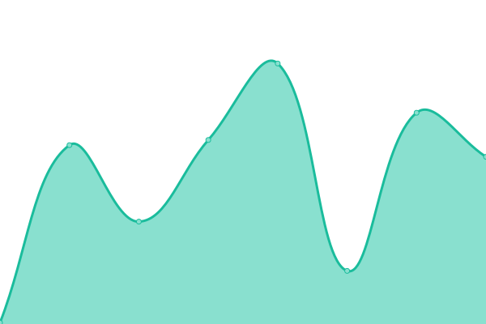

# [📈 Live Status](https://uptimes.chaotic.cx): <!--live status--> **🟧 Partial outage**

This repository contains the open-source uptime monitor and status page for [Chaotic-AUR](https://aur.chaotic.cx), powered by [Upptime](https://github.com/upptime/upptime).

Whenever downtimes are detected, a corresponding [issue](https://github.com/chaotic-aur/chaotic-uptimes/issues) is opened in which the mirror maintainer gets tagged.

<!--start: status pages-->
<!-- This summary is generated by Upptime (https://github.com/upptime/upptime) -->
<!-- Do not edit this manually, your changes will be overwritten -->
<!-- prettier-ignore -->
| URL | Status | History | Response Time | Uptime |
| --- | ------ | ------- | ------------- | ------ |
|  [Homepage](https://aur.chaotic.cx) | 🟩 Up | [homepage.yml](https://github.com/chaotic-aur/chaotic-uptimes/commits/HEAD/history/homepage.yml) | 

 258ms
     
 | 

<a href="https://uptimes.chaotic.cx/history/homepage">100.00%</a>
    

|  [The router](https://geo-mirror.chaotic.cx) | 🟩 Up | [the-router.yml](https://github.com/chaotic-aur/chaotic-uptimes/commits/HEAD/history/the-router.yml) | 

 259ms
     
 | 

<a href="https://uptimes.chaotic.cx/history/the-router">100.00%</a>
    

|  [cdn (Cloudflare R2)](https://cdn-mirror.chaotic.cx/no-failover/chaotic-aur/lastupdate) | 🟩 Up | [cdn-cloudflare-r2.yml](https://github.com/chaotic-aur/chaotic-uptimes/commits/HEAD/history/cdn-cloudflare-r2.yml) | 

 642ms
     
 | 

<a href="https://uptimes.chaotic.cx/history/cdn-cloudflare-r2">100.00%</a>
    

|  [bg (Sudoman)](https://shantitribe.eu) | 🟩 Up | [bg-sudoman.yml](https://github.com/chaotic-aur/chaotic-uptimes/commits/HEAD/history/bg-sudoman.yml) | 

 801ms
     
 | 

<a href="https://uptimes.chaotic.cx/history/bg-sudoman">0.00%</a>
    

|  [br (UFSCar Alcateia)](mirror.ufscar.br) | 🟩 Up | [br-ufs-car-alcateia.yml](https://github.com/chaotic-aur/chaotic-uptimes/commits/HEAD/history/br-ufs-car-alcateia.yml) | 

 544ms
     
 | 

<a href="https://uptimes.chaotic.cx/history/br-ufs-car-alcateia">100.00%</a>
    

|  [ca (freebird54)](https://birdrepo.ddns.net) | 🟥 Down | [ca-freebird54.yml](https://github.com/chaotic-aur/chaotic-uptimes/commits/HEAD/history/ca-freebird54.yml) | 

 0ms
     
 | 

<a href="https://uptimes.chaotic.cx/history/ca-freebird54">0.00%</a>
    

|  [cdn-cn (Aliyun)](https://cdn-cn-mirror.chaotic.cx/) | 🟩 Up | [cdn-cn-aliyun.yml](https://github.com/chaotic-aur/chaotic-uptimes/commits/HEAD/history/cdn-cn-aliyun.yml) | 

 192ms
     
 | 

<a href="https://uptimes.chaotic.cx/history/cdn-cn-aliyun">100.00%</a>
    

|  [cl (jkcgs)](https://mirror.owo.cl) | 🟩 Up | [cl-jkcgs.yml](https://github.com/chaotic-aur/chaotic-uptimes/commits/HEAD/history/cl-jkcgs.yml) | 

 668ms
     
 | 

<a href="https://uptimes.chaotic.cx/history/cl-jkcgs">100.00%</a>
    

|  [de-2 (Bangl)](https://chaotic.bangl.de) | 🟥 Down | [de-2-bangl.yml](https://github.com/chaotic-aur/chaotic-uptimes/commits/HEAD/history/de-2-bangl.yml) | 

 0ms
     
 | 

<a href="https://uptimes.chaotic.cx/history/de-2-bangl">100.00%</a>
    

|  [de-3 (itsTyrion)](https://v.itstyrion.de) | 🟩 Up | [de-3-its-tyrion.yml](https://github.com/chaotic-aur/chaotic-uptimes/commits/HEAD/history/de-3-its-tyrion.yml) | 

 885ms
     
 | 

<a href="https://uptimes.chaotic.cx/history/de-3-its-tyrion">0.00%</a>
    

|  [de-4 (redglobuli)](https://chaotic.pl4ygr0und.de) | 🟩 Up | [de-4-redglobuli.yml](https://github.com/chaotic-aur/chaotic-uptimes/commits/HEAD/history/de-4-redglobuli.yml) | 

 635ms
     
 | 

<a href="https://uptimes.chaotic.cx/history/de-4-redglobuli">100.00%</a>
    

|  [es (JKA Network)](https://repo.jkanetwork.com) | 🟩 Up | [es-jka-network.yml](https://github.com/chaotic-aur/chaotic-uptimes/commits/HEAD/history/es-jka-network.yml) | 

 799ms
     
 | 

<a href="https://uptimes.chaotic.cx/history/es-jka-network">100.00%</a>
    

|  [es-2 (Ícar)](https://chaotic.icarns.xyz) | 🟩 Up | [es-2-icar.yml](https://github.com/chaotic-aur/chaotic-uptimes/commits/HEAD/history/es-2-icar.yml) | 

 532ms
     
 | 

<a href="https://uptimes.chaotic.cx/history/es-2-icar">100.00%</a>
    

|  [es-4 (Ícar)](https://chaotic-2.icarns.xyz) | 🟩 Up | [es-4-icar.yml](https://github.com/chaotic-aur/chaotic-uptimes/commits/HEAD/history/es-4-icar.yml) | 

 478ms
     
 | 

<a href="https://uptimes.chaotic.cx/history/es-4-icar">100.00%</a>
    

|  [fr (Yael)](https://chaotic-mirror.bbq.ovh) | 🟥 Down | [fr-yael.yml](https://github.com/chaotic-aur/chaotic-uptimes/commits/HEAD/history/fr-yael.yml) | 

 127ms
     
 | 

<a href="https://uptimes.chaotic.cx/history/fr-yael">0.00%</a>
    

|  [gr (vmmaniac)](https://mirrors.sytes.net) | 🟩 Up | [gr-vmmaniac.yml](https://github.com/chaotic-aur/chaotic-uptimes/commits/HEAD/history/gr-vmmaniac.yml) | 

 697ms
     
 | 

<a href="https://uptimes.chaotic.cx/history/gr-vmmaniac">100.00%</a>
    

|  [in (Naman)](https://in-mirror.garudalinux.org) | 🟩 Up | [in-naman.yml](https://github.com/chaotic-aur/chaotic-uptimes/commits/HEAD/history/in-naman.yml) | 

 0ms
     
 | 

<a href="https://uptimes.chaotic.cx/history/in-naman">0.00%</a>
    

|  [in-2 (Albony)](https://mirror.albony.xyz) | 🟩 Up | [in-2-albony.yml](https://github.com/chaotic-aur/chaotic-uptimes/commits/HEAD/history/in-2-albony.yml) | 

 1457ms
     
 | 

<a href="https://uptimes.chaotic.cx/history/in-2-albony">100.00%</a>
    

|  [in-4 (Albony)](http://mirror.maa.albony.in) | 🟩 Up | [in-4-albony.yml](https://github.com/chaotic-aur/chaotic-uptimes/commits/HEAD/history/in-4-albony.yml) | 

 506ms
     
 | 

<a href="https://uptimes.chaotic.cx/history/in-4-albony">0.00%</a>
    

|  [kr (silent-heigou)](https://mirror.heigou.pe.kr) | 🟩 Up | [kr-silent-heigou.yml](https://github.com/chaotic-aur/chaotic-uptimes/commits/HEAD/history/kr-silent-heigou.yml) | 

 1597ms
     
 | 

<a href="https://uptimes.chaotic.cx/history/kr-silent-heigou">0.00%</a>
    

|  [secret (Garuda)](https://builds.garudalinux.org) | 🟩 Up | [secret-garuda.yml](https://github.com/chaotic-aur/chaotic-uptimes/commits/HEAD/history/secret-garuda.yml) | 

 623ms
     
 | 

<a href="https://uptimes.chaotic.cx/history/secret-garuda">100.00%</a>
    

|  [sg (Freedif)](https://mirror.freedif.org) | 🟩 Up | [sg-freedif.yml](https://github.com/chaotic-aur/chaotic-uptimes/commits/HEAD/history/sg-freedif.yml) | 

 1134ms
     
 | 

<a href="https://uptimes.chaotic.cx/history/sg-freedif">100.00%</a>
    

|  [us-mi (Technetium1)](https://chaoticmirror.com) | 🟩 Up | [us-mi-technetium1.yml](https://github.com/chaotic-aur/chaotic-uptimes/commits/HEAD/history/us-mi-technetium1.yml) | 

 205ms
     
 | 

<a href="https://uptimes.chaotic.cx/history/us-mi-technetium1">100.00%</a>
    

|  [us-tx (xstefen)](https://chaotic.xstefen.dev) | 🟥 Down | [us-tx-xstefen.yml](https://github.com/chaotic-aur/chaotic-uptimes/commits/HEAD/history/us-tx-xstefen.yml) | 

 0ms
     
 | 

<a href="https://uptimes.chaotic.cx/history/us-tx-xstefen">0.00%</a>
    

|  [us-ut (Ash)](https://mirror.theash.xyz) | 🟩 Up | [us-ut-ash.yml](https://github.com/chaotic-aur/chaotic-uptimes/commits/HEAD/history/us-ut-ash.yml) | 

 280ms
     
 | 

<a href="https://uptimes.chaotic.cx/history/us-ut-ash">0.00%</a>
    

<!--end: status pages-->

[**Visit our status website →**](https://uptimes.chaotic.cx)

## 📄 License

- Powered by: [Upptime](https://github.com/upptime/upptime)
- Code: [MIT](./LICENSE) © [Chaotic-AUR](https://aur.chaotic.cx)
- Data in the `./history` directory: [Open Database License](https://opendatacommons.org/licenses/odbl/1-0/)
