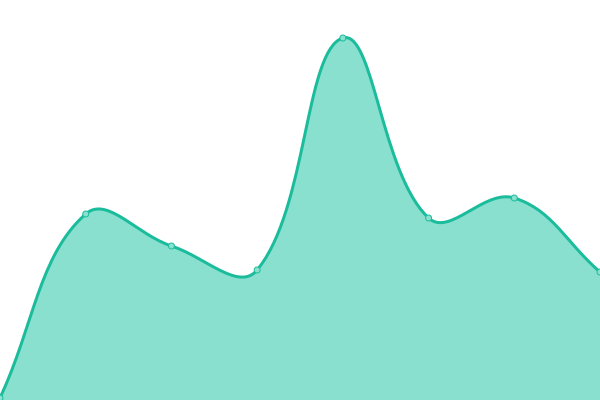

# [📈 Live Status](https://uptimes.chaotic.cx): <!--live status--> **🟧 Partial outage**

This repository contains the open-source uptime monitor and status page for [Chaotic-AUR](https://aur.chaotic.cx), powered by [Upptime](https://github.com/upptime/upptime).

Whenever downtimes are detected, a corresponding [issue](https://github.com/chaotic-aur/chaotic-uptimes/issues) is opened in which the mirror maintainer gets tagged.

<!--start: status pages-->
<!-- This summary is generated by Upptime (https://github.com/upptime/upptime) -->
<!-- Do not edit this manually, your changes will be overwritten -->
<!-- prettier-ignore -->
| URL | Status | History | Response Time | Uptime |
| --- | ------ | ------- | ------------- | ------ |
|  [Homepage](https://aur.chaotic.cx) | 🟩 Up | [homepage.yml](https://github.com/chaotic-aur/chaotic-uptimes/commits/HEAD/history/homepage.yml) | 

 212ms
     
 | 

<a href="https://uptimes.chaotic.cx/history/homepage">100.00%</a>
    

|  [The router](https://geo-mirror.chaotic.cx) | 🟩 Up | [the-router.yml](https://github.com/chaotic-aur/chaotic-uptimes/commits/HEAD/history/the-router.yml) | 

 233ms
     
 | 

<a href="https://uptimes.chaotic.cx/history/the-router">100.00%</a>
    

|  [cdn (Cloudflare R2)](https://cdn-mirror.chaotic.cx/no-failover/chaotic-aur/lastupdate) | 🟩 Up | [cdn-cloudflare-r2.yml](https://github.com/chaotic-aur/chaotic-uptimes/commits/HEAD/history/cdn-cloudflare-r2.yml) | 

 570ms
     
 | 

<a href="https://uptimes.chaotic.cx/history/cdn-cloudflare-r2">99.72%</a>
    

|  [bg (Sudoman)](https://bg-mirror.chaotic.cx/no-failover/chaotic-aur/lastupdate) | 🟩 Up | [bg-sudoman.yml](https://github.com/chaotic-aur/chaotic-uptimes/commits/HEAD/history/bg-sudoman.yml) | 

 571ms
     
 | 

<a href="https://uptimes.chaotic.cx/history/bg-sudoman">99.94%</a>
    

|  [br (UFSCar Alcateia)](https://br-mirror.chaotic.cx/no-failover/chaotic-aur/lastupdate) | 🟩 Up | [br-ufs-car-alcateia.yml](https://github.com/chaotic-aur/chaotic-uptimes/commits/HEAD/history/br-ufs-car-alcateia.yml) | 

 689ms
     
 | 

<a href="https://uptimes.chaotic.cx/history/br-ufs-car-alcateia">99.94%</a>
    

|  [br-2 (Alisson)](https://br-2-mirror.chaotic.cx/no-failover/chaotic-aur/lastupdate) | 🟩 Up | [br-2-alisson.yml](https://github.com/chaotic-aur/chaotic-uptimes/commits/HEAD/history/br-2-alisson.yml) | 

 554ms
     
 | 

<a href="https://uptimes.chaotic.cx/history/br-2-alisson">100.00%</a>
    

|  [ca (freebird54)](https://ca-mirror.chaotic.cx/no-failover/chaotic-aur/lastupdate) | 🟩 Up | [ca-freebird54.yml](https://github.com/chaotic-aur/chaotic-uptimes/commits/HEAD/history/ca-freebird54.yml) | 

 322ms
     
 | 

<a href="https://uptimes.chaotic.cx/history/ca-freebird54">100.00%</a>
    

|  [cdn (Fosshost)](https://cdn-mirror.chaotic.cx/no-failover/chaotic-aur/lastupdate) | 🟩 Up | [cdn-fosshost.yml](https://github.com/chaotic-aur/chaotic-uptimes/commits/HEAD/history/cdn-fosshost.yml) | 

 379ms
     
 | 

<a href="https://uptimes.chaotic.cx/history/cdn-fosshost">99.72%</a>
    

|  [cdn-cn (Aliyun)](https://cdn-cn-mirror.chaotic.cx/) | 🟩 Up | [cdn-cn-aliyun.yml](https://github.com/chaotic-aur/chaotic-uptimes/commits/HEAD/history/cdn-cn-aliyun.yml) | 

 248ms
     
 | 

<a href="https://uptimes.chaotic.cx/history/cdn-cn-aliyun">100.00%</a>
    

|  [cl (jkcgs)](https://cl-mirror.chaotic.cx/no-failover/chaotic-aur/lastupdate) | 🟩 Up | [cl-jkcgs.yml](https://github.com/chaotic-aur/chaotic-uptimes/commits/HEAD/history/cl-jkcgs.yml) | 

 980ms
     
 | 

<a href="https://uptimes.chaotic.cx/history/cl-jkcgs">100.00%</a>
    

|  [de (dr460nf1r3)](https://de-mirror.chaotic.cx/no-failover/chaotic-aur/lastupdate) | 🟩 Up | [de-dr460nf1r3.yml](https://github.com/chaotic-aur/chaotic-uptimes/commits/HEAD/history/de-dr460nf1r3.yml) | 

 676ms
     
 | 

<a href="https://uptimes.chaotic.cx/history/de-dr460nf1r3">100.00%</a>
    

|  [de-2 (Bangl)](https://de-2-mirror.chaotic.cx/no-failover/chaotic-aur/lastupdate) | 🟩 Up | [de-2-bangl.yml](https://github.com/chaotic-aur/chaotic-uptimes/commits/HEAD/history/de-2-bangl.yml) | 

 970ms
     
 | 

<a href="https://uptimes.chaotic.cx/history/de-2-bangl">100.00%</a>
    

|  [de-3 (itsTyrion)](https://de-3-mirror.chaotic.cx/no-failover/chaotic-aur/lastupdate) | 🟩 Up | [de-3-its-tyrion.yml](https://github.com/chaotic-aur/chaotic-uptimes/commits/HEAD/history/de-3-its-tyrion.yml) | 

 1271ms
     
 | 

<a href="https://uptimes.chaotic.cx/history/de-3-its-tyrion">100.00%</a>
    

|  [de-4 (redglobuli)](https://de-4-mirror.chaotic.cx/no-failover/chaotic-aur/lastupdate) | 🟩 Up | [de-4-redglobuli.yml](https://github.com/chaotic-aur/chaotic-uptimes/commits/HEAD/history/de-4-redglobuli.yml) | 

 784ms
     
 | 

<a href="https://uptimes.chaotic.cx/history/de-4-redglobuli">100.00%</a>
    

|  [es (JKA Network)](https://es-mirror.chaotic.cx/no-failover/chaotic-aur/lastupdate) | 🟩 Up | [es-jka-network.yml](https://github.com/chaotic-aur/chaotic-uptimes/commits/HEAD/history/es-jka-network.yml) | 

 2000ms
     
 | 

<a href="https://uptimes.chaotic.cx/history/es-jka-network">99.61%</a>
    

|  [es-2 (Ícar)](https://es-2-mirror.chaotic.cx/no-failover/chaotic-aur/lastupdate) | 🟩 Up | [es-2-icar.yml](https://github.com/chaotic-aur/chaotic-uptimes/commits/HEAD/history/es-2-icar.yml) | 

 629ms
     
 | 

<a href="https://uptimes.chaotic.cx/history/es-2-icar">99.83%</a>
    

|  [fr (Snowy)](https://fr-mirror.chaotic.cx/no-failover/chaotic-aur/lastupdate) | 🟩 Up | [fr-snowy.yml](https://github.com/chaotic-aur/chaotic-uptimes/commits/HEAD/history/fr-snowy.yml) | 

 532ms
     
 | 

<a href="https://uptimes.chaotic.cx/history/fr-snowy">100.00%</a>
    

|  [gr (vmmaniac)](https://gr-mirror.chaotic.cx/no-failover/chaotic-aur/lastupdate) | 🟩 Up | [gr-vmmaniac.yml](https://github.com/chaotic-aur/chaotic-uptimes/commits/HEAD/history/gr-vmmaniac.yml) | 

 576ms
     
 | 

<a href="https://uptimes.chaotic.cx/history/gr-vmmaniac">100.00%</a>
    

|  [in (Naman)](https://in-mirror.chaotic.cx/no-failover/chaotic-aur/lastupdate) | 🟩 Up | [in-naman.yml](https://github.com/chaotic-aur/chaotic-uptimes/commits/HEAD/history/in-naman.yml) | 

 0ms
     
 | 

<a href="https://uptimes.chaotic.cx/history/in-naman">99.67%</a>
    

|  [in-2 (Albony)](https://in-2-mirror.chaotic.cx/no-failover/chaotic-aur/lastupdate) | 🟩 Up | [in-2-albony.yml](https://github.com/chaotic-aur/chaotic-uptimes/commits/HEAD/history/in-2-albony.yml) | 

 661ms
     
 | 

<a href="https://uptimes.chaotic.cx/history/in-2-albony">100.00%</a>
    

|  [kr (silent-heigou)](https://kr-mirror.chaotic.cx/no-failover/chaotic-aur/lastupdate) | 🟩 Up | [kr-silent-heigou.yml](https://github.com/chaotic-aur/chaotic-uptimes/commits/HEAD/history/kr-silent-heigou.yml) | 

 2079ms
     
 | 

<a href="https://uptimes.chaotic.cx/history/kr-silent-heigou">100.00%</a>
    

|  [secret (Garuda)](https://secret-mirror.chaotic.cx/no-failover/chaotic-aur/lastupdate) | 🟩 Up | [secret-garuda.yml](https://github.com/chaotic-aur/chaotic-uptimes/commits/HEAD/history/secret-garuda.yml) | 

 413ms
     
 | 

<a href="https://uptimes.chaotic.cx/history/secret-garuda">100.00%</a>
    

|  [sg (Freedif)](https://sg-mirror.chaotic.cx/no-failover/chaotic-aur/lastupdate) | 🟥 Down | [sg-freedif.yml](https://github.com/chaotic-aur/chaotic-uptimes/commits/HEAD/history/sg-freedif.yml) | 

 1104ms
     
 | 

<a href="https://uptimes.chaotic.cx/history/sg-freedif">99.99%</a>
    

|  [us-fl (Alisson)](https://us-fl-mirror.chaotic.cx/no-failover/chaotic-aur/lastupdate) | 🟩 Up | [us-fl-alisson.yml](https://github.com/chaotic-aur/chaotic-uptimes/commits/HEAD/history/us-fl-alisson.yml) | 

 349ms
     
 | 

<a href="https://uptimes.chaotic.cx/history/us-fl-alisson">100.00%</a>
    

|  [us-mi (Technetium1)](https://us-mi-mirror.chaotic.cx/no-failover/chaotic-aur/lastupdate) | 🟩 Up | [us-mi-technetium1.yml](https://github.com/chaotic-aur/chaotic-uptimes/commits/HEAD/history/us-mi-technetium1.yml) | 

 344ms
     
 | 

<a href="https://uptimes.chaotic.cx/history/us-mi-technetium1">100.00%</a>
    

|  [us-tx (xstefen)](https://us-tx-mirror.chaotic.cx/no-failover/chaotic-aur/lastupdate) | 🟥 Down | [us-tx-xstefen.yml](https://github.com/chaotic-aur/chaotic-uptimes/commits/HEAD/history/us-tx-xstefen.yml) | 

 485ms
     
 | 

<a href="https://uptimes.chaotic.cx/history/us-tx-xstefen">84.95%</a>
    

|  [us-ut (Ash)](https://us-ut-mirror.chaotic.cx/no-failover/chaotic-aur/lastupdate) | 🟩 Up | [us-ut-ash.yml](https://github.com/chaotic-aur/chaotic-uptimes/commits/HEAD/history/us-ut-ash.yml) | 

 579ms
     
 | 

<a href="https://uptimes.chaotic.cx/history/us-ut-ash">100.00%</a>
    

|  [us-va (Zoe)](https://us-ut-mirror.chaotic.cx/no-failover/chaotic-aur/lastupdate) | 🟩 Up | [us-va-zoe.yml](https://github.com/chaotic-aur/chaotic-uptimes/commits/HEAD/history/us-va-zoe.yml) | 

 265ms
     
 | 

<a href="https://uptimes.chaotic.cx/history/us-va-zoe">100.00%</a>
    

|  [Silky.Network - ae](https://ae-mirror.chaotic.cx/no-failover/chaotic-aur/lastupdate) | 🟩 Up | [silky-network-ae.yml](https://github.com/chaotic-aur/chaotic-uptimes/commits/HEAD/history/silky-network-ae.yml) | 

 1166ms
     
 | 

<a href="https://uptimes.chaotic.cx/history/silky-network-ae">93.02%</a>
    

|  [Silky.Network - ae-2](https://ae-2-mirror.chaotic.cx/no-failover/chaotic-aur/lastupdate) | 🟩 Up | [silky-network-ae-2.yml](https://github.com/chaotic-aur/chaotic-uptimes/commits/HEAD/history/silky-network-ae-2.yml) | 

 1093ms
     
 | 

<a href="https://uptimes.chaotic.cx/history/silky-network-ae-2">93.02%</a>
    

|  [Silky.Network - ae-3](https://ae-3-mirror.chaotic.cx/no-failover/chaotic-aur/lastupdate) | 🟩 Up | [silky-network-ae-3.yml](https://github.com/chaotic-aur/chaotic-uptimes/commits/HEAD/history/silky-network-ae-3.yml) | 

 1103ms
     
 | 

<a href="https://uptimes.chaotic.cx/history/silky-network-ae-3">93.02%</a>
    

|  [Silky.Network - au](https://au-mirror.chaotic.cx/no-failover/chaotic-aur/lastupdate) | 🟩 Up | [silky-network-au.yml](https://github.com/chaotic-aur/chaotic-uptimes/commits/HEAD/history/silky-network-au.yml) | 

 804ms
     
 | 

<a href="https://uptimes.chaotic.cx/history/silky-network-au">93.02%</a>
    

|  [Silky.Network - au-2](https://au-2-mirror.chaotic.cx/no-failover/chaotic-aur/lastupdate) | 🟩 Up | [silky-network-au-2.yml](https://github.com/chaotic-aur/chaotic-uptimes/commits/HEAD/history/silky-network-au-2.yml) | 

 983ms
     
 | 

<a href="https://uptimes.chaotic.cx/history/silky-network-au-2">93.02%</a>
    

|  [Silky.Network - br-3](https://br-3-mirror.chaotic.cx/no-failover/chaotic-aur/lastupdate) | 🟩 Up | [silky-network-br-3.yml](https://github.com/chaotic-aur/chaotic-uptimes/commits/HEAD/history/silky-network-br-3.yml) | 

 657ms
     
 | 

<a href="https://uptimes.chaotic.cx/history/silky-network-br-3">93.02%</a>
    

|  [Silky.Network - br-4](https://br-4-mirror.chaotic.cx/no-failover/chaotic-aur/lastupdate) | 🟩 Up | [silky-network-br-4.yml](https://github.com/chaotic-aur/chaotic-uptimes/commits/HEAD/history/silky-network-br-4.yml) | 

 570ms
     
 | 

<a href="https://uptimes.chaotic.cx/history/silky-network-br-4">92.86%</a>
    

|  [Silky.Network - ca-2](https://ca-2-mirror.chaotic.cx/no-failover/chaotic-aur/lastupdate) | 🟩 Up | [silky-network-ca-2.yml](https://github.com/chaotic-aur/chaotic-uptimes/commits/HEAD/history/silky-network-ca-2.yml) | 

 282ms
     
 | 

<a href="https://uptimes.chaotic.cx/history/silky-network-ca-2">93.02%</a>
    

|  [Silky.Network - ca-3](https://ca-3-mirror.chaotic.cx/no-failover/chaotic-aur/lastupdate) | 🟩 Up | [silky-network-ca-3.yml](https://github.com/chaotic-aur/chaotic-uptimes/commits/HEAD/history/silky-network-ca-3.yml) | 

 302ms
     
 | 

<a href="https://uptimes.chaotic.cx/history/silky-network-ca-3">93.02%</a>
    

|  [Silky.Network - ch-2](https://ch-2-mirror.chaotic.cx/no-failover/chaotic-aur/lastupdate) | 🟩 Up | [silky-network-ch-2.yml](https://github.com/chaotic-aur/chaotic-uptimes/commits/HEAD/history/silky-network-ch-2.yml) | 

 563ms
     
 | 

<a href="https://uptimes.chaotic.cx/history/silky-network-ch-2">93.02%</a>
    

|  [Silky.Network - cl-2](https://cl-2-mirror.chaotic.cx/no-failover/chaotic-aur/lastupdate) | 🟩 Up | [silky-network-cl-2.yml](https://github.com/chaotic-aur/chaotic-uptimes/commits/HEAD/history/silky-network-cl-2.yml) | 

 594ms
     
 | 

<a href="https://uptimes.chaotic.cx/history/silky-network-cl-2">93.02%</a>
    

|  [Silky.Network - fr-2](https://fr-2-mirror.chaotic.cx/no-failover/chaotic-aur/lastupdate) | 🟩 Up | [silky-network-fr-2.yml](https://github.com/chaotic-aur/chaotic-uptimes/commits/HEAD/history/silky-network-fr-2.yml) | 

 595ms
     
 | 

<a href="https://uptimes.chaotic.cx/history/silky-network-fr-2">93.02%</a>
    

|  [Silky.Network - fr-3](https://fr-3-mirror.chaotic.cx/no-failover/chaotic-aur/lastupdate) | 🟩 Up | [silky-network-fr-3.yml](https://github.com/chaotic-aur/chaotic-uptimes/commits/HEAD/history/silky-network-fr-3.yml) | 

 477ms
     
 | 

<a href="https://uptimes.chaotic.cx/history/silky-network-fr-3">93.02%</a>
    

|  [Silky.Network - de-5](https://de-5-mirror.chaotic.cx/no-failover/chaotic-aur/lastupdate) | 🟩 Up | [silky-network-de-5.yml](https://github.com/chaotic-aur/chaotic-uptimes/commits/HEAD/history/silky-network-de-5.yml) | 

 545ms
     
 | 

<a href="https://uptimes.chaotic.cx/history/silky-network-de-5">93.02%</a>
    

|  [Silky.Network - de-6](https://de-6-mirror.chaotic.cx/no-failover/chaotic-aur/lastupdate) | 🟩 Up | [silky-network-de-6.yml](https://github.com/chaotic-aur/chaotic-uptimes/commits/HEAD/history/silky-network-de-6.yml) | 

 522ms
     
 | 

<a href="https://uptimes.chaotic.cx/history/silky-network-de-6">93.02%</a>
    

|  [Silky.Network - es-3](https://es-3-mirror.chaotic.cx/no-failover/chaotic-aur/lastupdate) | 🟩 Up | [silky-network-es-3.yml](https://github.com/chaotic-aur/chaotic-uptimes/commits/HEAD/history/silky-network-es-3.yml) | 

 544ms
     
 | 

<a href="https://uptimes.chaotic.cx/history/silky-network-es-3">93.02%</a>
    

|  [Silky.Network - il](https://il-mirror.chaotic.cx/no-failover/chaotic-aur/lastupdate) | 🟩 Up | [silky-network-il.yml](https://github.com/chaotic-aur/chaotic-uptimes/commits/HEAD/history/silky-network-il.yml) | 

 664ms
     
 | 

<a href="https://uptimes.chaotic.cx/history/silky-network-il">93.02%</a>
    

|  [Silky.Network - in-4](https://in-4-mirror.chaotic.cx/no-failover/chaotic-aur/lastupdate) | 🟩 Up | [silky-network-in-4.yml](https://github.com/chaotic-aur/chaotic-uptimes/commits/HEAD/history/silky-network-in-4.yml) | 

 763ms
     
 | 

<a href="https://uptimes.chaotic.cx/history/silky-network-in-4">93.02%</a>
    

|  [Silky.Network - in-5](https://in-5-mirror.chaotic.cx/no-failover/chaotic-aur/lastupdate) | 🟩 Up | [silky-network-in-5.yml](https://github.com/chaotic-aur/chaotic-uptimes/commits/HEAD/history/silky-network-in-5.yml) | 

 1076ms
     
 | 

<a href="https://uptimes.chaotic.cx/history/silky-network-in-5">93.02%</a>
    

|  [Silky.Network - in-6](https://in-6-mirror.chaotic.cx/no-failover/chaotic-aur/lastupdate) | 🟩 Up | [silky-network-in-6.yml](https://github.com/chaotic-aur/chaotic-uptimes/commits/HEAD/history/silky-network-in-6.yml) | 

 1007ms
     
 | 

<a href="https://uptimes.chaotic.cx/history/silky-network-in-6">93.02%</a>
    

|  [Silky.Network - jp](https://jp-mirror.chaotic.cx/no-failover/chaotic-aur/lastupdate) | 🟩 Up | [silky-network-jp.yml](https://github.com/chaotic-aur/chaotic-uptimes/commits/HEAD/history/silky-network-jp.yml) | 

 669ms
     
 | 

<a href="https://uptimes.chaotic.cx/history/silky-network-jp">93.02%</a>
    

|  [Silky.Network - jp-2](https://jp-2-mirror.chaotic.cx/no-failover/chaotic-aur/lastupdate) | 🟩 Up | [silky-network-jp-2.yml](https://github.com/chaotic-aur/chaotic-uptimes/commits/HEAD/history/silky-network-jp-2.yml) | 

 679ms
     
 | 

<a href="https://uptimes.chaotic.cx/history/silky-network-jp-2">93.02%</a>
    

|  [Silky.Network - kr-2](https://kr-2-mirror.chaotic.cx/no-failover/chaotic-aur/lastupdate) | 🟩 Up | [silky-network-kr-2.yml](https://github.com/chaotic-aur/chaotic-uptimes/commits/HEAD/history/silky-network-kr-2.yml) | 

 629ms
     
 | 

<a href="https://uptimes.chaotic.cx/history/silky-network-kr-2">93.02%</a>
    

|  [Silky.Network - kr-4](https://kr-4-mirror.chaotic.cx/no-failover/chaotic-aur/lastupdate) | 🟩 Up | [silky-network-kr-4.yml](https://github.com/chaotic-aur/chaotic-uptimes/commits/HEAD/history/silky-network-kr-4.yml) | 

 254ms
     
 | 

<a href="https://uptimes.chaotic.cx/history/silky-network-kr-4">99.52%</a>
    

|  [Silky.Network - mx](https://mx-mirror.chaotic.cx/no-failover/chaotic-aur/lastupdate) | 🟩 Up | [silky-network-mx.yml](https://github.com/chaotic-aur/chaotic-uptimes/commits/HEAD/history/silky-network-mx.yml) | 

 281ms
     
 | 

<a href="https://uptimes.chaotic.cx/history/silky-network-mx">93.02%</a>
    

|  [Silky.Network - nl-2](https://nl-2-mirror.chaotic.cx/no-failover/chaotic-aur/lastupdate) | 🟩 Up | [silky-network-nl-2.yml](https://github.com/chaotic-aur/chaotic-uptimes/commits/HEAD/history/silky-network-nl-2.yml) | 

 553ms
     
 | 

<a href="https://uptimes.chaotic.cx/history/silky-network-nl-2">93.02%</a>
    

|  [Silky.Network - sa](https://sa-mirror.chaotic.cx/no-failover/chaotic-aur/lastupdate) | 🟩 Up | [silky-network-sa.yml](https://github.com/chaotic-aur/chaotic-uptimes/commits/HEAD/history/silky-network-sa.yml) | 

 783ms
     
 | 

<a href="https://uptimes.chaotic.cx/history/silky-network-sa">93.02%</a>
    

|  [Silky.Network - se](https://se-mirror.chaotic.cx/no-failover/chaotic-aur/lastupdate) | 🟩 Up | [silky-network-se.yml](https://github.com/chaotic-aur/chaotic-uptimes/commits/HEAD/history/silky-network-se.yml) | 

 528ms
     
 | 

<a href="https://uptimes.chaotic.cx/history/silky-network-se">93.02%</a>
    

|  [Silky.Network - uk](https://uk-mirror.chaotic.cx/no-failover/chaotic-aur/lastupdate) | 🟩 Up | [silky-network-uk.yml](https://github.com/chaotic-aur/chaotic-uptimes/commits/HEAD/history/silky-network-uk.yml) | 

 459ms
     
 | 

<a href="https://uptimes.chaotic.cx/history/silky-network-uk">93.02%</a>
    

|  [Silky.Network - uk-2](https://uk-2-mirror.chaotic.cx/no-failover/chaotic-aur/lastupdate) | 🟩 Up | [silky-network-uk-2.yml](https://github.com/chaotic-aur/chaotic-uptimes/commits/HEAD/history/silky-network-uk-2.yml) | 

 499ms
     
 | 

<a href="https://uptimes.chaotic.cx/history/silky-network-uk-2">93.02%</a>
    

|  [Silky.Network - us-ca](https://us-ca-mirror.chaotic.cx/no-failover/chaotic-aur/lastupdate) | 🟩 Up | [silky-network-us-ca.yml](https://github.com/chaotic-aur/chaotic-uptimes/commits/HEAD/history/silky-network-us-ca.yml) | 

 735ms
     
 | 

<a href="https://uptimes.chaotic.cx/history/silky-network-us-ca">92.68%</a>
    

|  [Silky.Network - us-tx-2](https://us-tx-2-mirror.chaotic.cx/no-failover/chaotic-aur/lastupdate) | 🟩 Up | [silky-network-us-tx-2.yml](https://github.com/chaotic-aur/chaotic-uptimes/commits/HEAD/history/silky-network-us-tx-2.yml) | 

 326ms
     
 | 

<a href="https://uptimes.chaotic.cx/history/silky-network-us-tx-2">93.02%</a>
    

|  [Silky.Network - za](https://za-mirror.chaotic.cx/no-failover/chaotic-aur/lastupdate) | 🟩 Up | [silky-network-za.yml](https://github.com/chaotic-aur/chaotic-uptimes/commits/HEAD/history/silky-network-za.yml) | 

 1133ms
     
 | 

<a href="https://uptimes.chaotic.cx/history/silky-network-za">93.02%</a>
    

<!--end: status pages-->

[**Visit our status website →**](https://uptimes.chaotic.cx)

## 📄 License

- Powered by: [Upptime](https://github.com/upptime/upptime)
- Code: [MIT](./LICENSE) © [Chaotic-AUR](https://aur.chaotic.cx)
- Data in the `./history` directory: [Open Database License](https://opendatacommons.org/licenses/odbl/1-0/)
