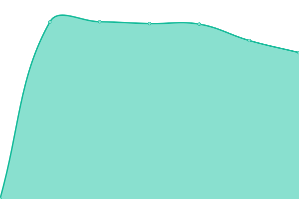

# [📈 Live Status](https://uptimes.chaotic.cx): <!--live status--> **🟧 Partial outage**

This repository contains the open-source uptime monitor and status page for [Chaotic-AUR](https://aur.chaotic.cx), powered by [Upptime](https://github.com/upptime/upptime).

Whenever downtimes are detected, a corresponding [issue](https://github.com/chaotic-aur/chaotic-uptimes/issues) is opened in which the mirror maintainer gets tagged.

<!--start: status pages-->
<!-- This summary is generated by Upptime (https://github.com/upptime/upptime) -->
<!-- Do not edit this manually, your changes will be overwritten -->
<!-- prettier-ignore -->
| URL | Status | History | Response Time | Uptime |
| --- | ------ | ------- | ------------- | ------ |
|  [Homepage](https://aur.chaotic.cx) | 🟩 Up | [homepage.yml](https://github.com/chaotic-aur/chaotic-uptimes/commits/HEAD/history/homepage.yml) | 

 644ms
     
 | 

<a href="https://uptimes.chaotic.cx/history/homepage">100.00%</a>
    

|  [The router](https://geo-mirror.chaotic.cx) | 🟩 Up | [the-router.yml](https://github.com/chaotic-aur/chaotic-uptimes/commits/HEAD/history/the-router.yml) | 

 400ms
     
 | 

<a href="https://uptimes.chaotic.cx/history/the-router">100.00%</a>
    

|  [cdn (Cloudflare R2)](https://cdn-mirror.chaotic.cx/no-failover/chaotic-aur/lastupdate) | 🟩 Up | [cdn-cloudflare-r2.yml](https://github.com/chaotic-aur/chaotic-uptimes/commits/HEAD/history/cdn-cloudflare-r2.yml) | 

 792ms
     
 | 

<a href="https://uptimes.chaotic.cx/history/cdn-cloudflare-r2">99.81%</a>
    

|  [bg (Sudoman)](https://shantitribe.eu) | 🟩 Up | [bg-sudoman.yml](https://github.com/chaotic-aur/chaotic-uptimes/commits/HEAD/history/bg-sudoman.yml) | 

 725ms
     
 | 

<a href="https://uptimes.chaotic.cx/history/bg-sudoman">100.00%</a>
    

|  [br (UFSCar Alcateia)](mirror.ufscar.br) | 🟩 Up | [br-ufs-car-alcateia.yml](https://github.com/chaotic-aur/chaotic-uptimes/commits/HEAD/history/br-ufs-car-alcateia.yml) | 

 502ms
     
 | 

<a href="https://uptimes.chaotic.cx/history/br-ufs-car-alcateia">99.94%</a>
    

|  [br-2 (Alisson)](br-mirror.amanoteam.com) | 🟩 Up | [br-2-alisson.yml](https://github.com/chaotic-aur/chaotic-uptimes/commits/HEAD/history/br-2-alisson.yml) | 

 805ms
     
 | 

<a href="https://uptimes.chaotic.cx/history/br-2-alisson">100.00%</a>
    

|  [ca (freebird54)](https://birdrepo.ddns.net) | 🟥 Down | [ca-freebird54.yml](https://github.com/chaotic-aur/chaotic-uptimes/commits/HEAD/history/ca-freebird54.yml) | 

 200ms
     
 | 

<a href="https://uptimes.chaotic.cx/history/ca-freebird54">72.05%</a>
    

|  [cdn-cn (Aliyun)](https://cdn-cn-mirror.chaotic.cx/) | 🟩 Up | [cdn-cn-aliyun.yml](https://github.com/chaotic-aur/chaotic-uptimes/commits/HEAD/history/cdn-cn-aliyun.yml) | 

 656ms
     
 | 

<a href="https://uptimes.chaotic.cx/history/cdn-cn-aliyun">100.00%</a>
    

|  [cl (jkcgs)](https://mirror.owo.cl) | 🟩 Up | [cl-jkcgs.yml](https://github.com/chaotic-aur/chaotic-uptimes/commits/HEAD/history/cl-jkcgs.yml) | 

 962ms
     
 | 

<a href="https://uptimes.chaotic.cx/history/cl-jkcgs">99.74%</a>
    

|  [de-2 (Bangl)](https://chaotic.bangl.de) | 🟥 Down | [de-2-bangl.yml](https://github.com/chaotic-aur/chaotic-uptimes/commits/HEAD/history/de-2-bangl.yml) | 

 0ms
     
 | 

<a href="https://uptimes.chaotic.cx/history/de-2-bangl">0.00%</a>
    

|  [de-3 (itsTyrion)](https://v.itstyrion.de) | 🟥 Down | [de-3-its-tyrion.yml](https://github.com/chaotic-aur/chaotic-uptimes/commits/HEAD/history/de-3-its-tyrion.yml) | 

 1154ms
     
 | 

<a href="https://uptimes.chaotic.cx/history/de-3-its-tyrion">0.00%</a>
    

|  [de-4 (redglobuli)](https://chaotic.pl4ygr0und.de) | 🟩 Up | [de-4-redglobuli.yml](https://github.com/chaotic-aur/chaotic-uptimes/commits/HEAD/history/de-4-redglobuli.yml) | 

 839ms
     
 | 

<a href="https://uptimes.chaotic.cx/history/de-4-redglobuli">100.00%</a>
    

|  [es (JKA Network)](https://repo.jkanetwork.com) | 🟩 Up | [es-jka-network.yml](https://github.com/chaotic-aur/chaotic-uptimes/commits/HEAD/history/es-jka-network.yml) | 

 1099ms
     
 | 

<a href="https://uptimes.chaotic.cx/history/es-jka-network">99.93%</a>
    

|  [es-2 (Ícar)](https://chaotic.icarns.xyz) | 🟩 Up | [es-2-icar.yml](https://github.com/chaotic-aur/chaotic-uptimes/commits/HEAD/history/es-2-icar.yml) | 

 570ms
     
 | 

<a href="https://uptimes.chaotic.cx/history/es-2-icar">100.00%</a>
    

|  [es-4 (Ícar)](https://chaotic-2.icarns.xyz) | 🟩 Up | [es-4-icar.yml](https://github.com/chaotic-aur/chaotic-uptimes/commits/HEAD/history/es-4-icar.yml) | 

 566ms
     
 | 

<a href="https://uptimes.chaotic.cx/history/es-4-icar">100.00%</a>
    

|  [fr (Snowy)](https://saturn.dedyn.io) | 🟩 Up | [fr-snowy.yml](https://github.com/chaotic-aur/chaotic-uptimes/commits/HEAD/history/fr-snowy.yml) | 

 538ms
     
 | 

<a href="https://uptimes.chaotic.cx/history/fr-snowy">100.00%</a>
    

|  [gr (vmmaniac)](https://mirrors.sytes.net) | 🟩 Up | [gr-vmmaniac.yml](https://github.com/chaotic-aur/chaotic-uptimes/commits/HEAD/history/gr-vmmaniac.yml) | 

 688ms
     
 | 

<a href="https://uptimes.chaotic.cx/history/gr-vmmaniac">100.00%</a>
    

|  [in (Naman)](https://in-mirror.garudalinux.org) | 🟥 Down | [in-naman.yml](https://github.com/chaotic-aur/chaotic-uptimes/commits/HEAD/history/in-naman.yml) | 

 0ms
     
 | 

<a href="https://uptimes.chaotic.cx/history/in-naman">85.03%</a>
    

|  [in-2 (Albony)](https://mirror.albony.xyz) | 🟩 Up | [in-2-albony.yml](https://github.com/chaotic-aur/chaotic-uptimes/commits/HEAD/history/in-2-albony.yml) | 

 979ms
     
 | 

<a href="https://uptimes.chaotic.cx/history/in-2-albony">98.07%</a>
    

|  [kr (silent-heigou)](https://mirror.heigou.pe.kr) | 🟩 Up | [kr-silent-heigou.yml](https://github.com/chaotic-aur/chaotic-uptimes/commits/HEAD/history/kr-silent-heigou.yml) | 

 1911ms
     
 | 

<a href="https://uptimes.chaotic.cx/history/kr-silent-heigou">100.00%</a>
    

|  [secret (Garuda)](https://builds.garudalinux.org) | 🟩 Up | [secret-garuda.yml](https://github.com/chaotic-aur/chaotic-uptimes/commits/HEAD/history/secret-garuda.yml) | 

 490ms
     
 | 

<a href="https://uptimes.chaotic.cx/history/secret-garuda">100.00%</a>
    

|  [sg (Freedif)](https://mirror.freedif.org) | 🟩 Up | [sg-freedif.yml](https://github.com/chaotic-aur/chaotic-uptimes/commits/HEAD/history/sg-freedif.yml) | 

 1238ms
     
 | 

<a href="https://uptimes.chaotic.cx/history/sg-freedif">100.00%</a>
    

|  [us-fl (Alisson)](https://us-fl-mirror.amanoteam.com) | 🟩 Up | [us-fl-alisson.yml](https://github.com/chaotic-aur/chaotic-uptimes/commits/HEAD/history/us-fl-alisson.yml) | 

 191ms
     
 | 

<a href="https://uptimes.chaotic.cx/history/us-fl-alisson">100.00%</a>
    

|  [us-mi (Technetium1)](https://chaoticmirror.com) | 🟩 Up | [us-mi-technetium1.yml](https://github.com/chaotic-aur/chaotic-uptimes/commits/HEAD/history/us-mi-technetium1.yml) | 

 257ms
     
 | 

<a href="https://uptimes.chaotic.cx/history/us-mi-technetium1">100.00%</a>
    

|  [us-ny (Zoe)](https://us-ny-mirror.garudalinux.org) | 🟥 Down | [us-ny-zoe.yml](https://github.com/chaotic-aur/chaotic-uptimes/commits/HEAD/history/us-ny-zoe.yml) | 

 93ms
     
 | 

<a href="https://uptimes.chaotic.cx/history/us-ny-zoe">0.00%</a>
    

|  [us-tx (xstefen)](https://chaotic.xstefen.dev) | 🟩 Up | [us-tx-xstefen.yml](https://github.com/chaotic-aur/chaotic-uptimes/commits/HEAD/history/us-tx-xstefen.yml) | 

 487ms
     
 | 

<a href="https://uptimes.chaotic.cx/history/us-tx-xstefen">100.00%</a>
    

|  [us-ut (Ash)](https://mirror.theash.xyz) | 🟩 Up | [us-ut-ash.yml](https://github.com/chaotic-aur/chaotic-uptimes/commits/HEAD/history/us-ut-ash.yml) | 

 222ms
     
 | 

<a href="https://uptimes.chaotic.cx/history/us-ut-ash">99.28%</a>
    

|  [Silky.Network - ae](https://dxb-ae-mirror.silky.network) | 🟩 Up | [silky-network-ae.yml](https://github.com/chaotic-aur/chaotic-uptimes/commits/HEAD/history/silky-network-ae.yml) | 

 1176ms
     
 | 

<a href="https://uptimes.chaotic.cx/history/silky-network-ae">100.00%</a>
    

|  [Silky.Network - ae-2](https://dxb1-ae-mirror.silky.network) | 🟩 Up | [silky-network-ae-2.yml](https://github.com/chaotic-aur/chaotic-uptimes/commits/HEAD/history/silky-network-ae-2.yml) | 

 1161ms
     
 | 

<a href="https://uptimes.chaotic.cx/history/silky-network-ae-2">100.00%</a>
    

|  [Silky.Network - ae-3](https://auh-ae-mirror.silky.network) | 🟩 Up | [silky-network-ae-3.yml](https://github.com/chaotic-aur/chaotic-uptimes/commits/HEAD/history/silky-network-ae-3.yml) | 

 1149ms
     
 | 

<a href="https://uptimes.chaotic.cx/history/silky-network-ae-3">100.00%</a>
    

|  [Silky.Network - au](https://syd-au-mirror.silky.network) | 🟩 Up | [silky-network-au.yml](https://github.com/chaotic-aur/chaotic-uptimes/commits/HEAD/history/silky-network-au.yml) | 

 823ms
     
 | 

<a href="https://uptimes.chaotic.cx/history/silky-network-au">100.00%</a>
    

|  [Silky.Network - au-2](https://mel-au-mirror.silky.network) | 🟩 Up | [silky-network-au-2.yml](https://github.com/chaotic-aur/chaotic-uptimes/commits/HEAD/history/silky-network-au-2.yml) | 

 943ms
     
 | 

<a href="https://uptimes.chaotic.cx/history/silky-network-au-2">100.00%</a>
    

|  [Silky.Network - br-3](https://vcp-br-mirror.silky.network) | 🟩 Up | [silky-network-br-3.yml](https://github.com/chaotic-aur/chaotic-uptimes/commits/HEAD/history/silky-network-br-3.yml) | 

 686ms
     
 | 

<a href="https://uptimes.chaotic.cx/history/silky-network-br-3">100.00%</a>
    

|  [Silky.Network - br-4](https://gru-br-mirror.silky.network) | 🟩 Up | [silky-network-br-4.yml](https://github.com/chaotic-aur/chaotic-uptimes/commits/HEAD/history/silky-network-br-4.yml) | 

 1957ms
     
 | 

<a href="https://uptimes.chaotic.cx/history/silky-network-br-4">94.19%</a>
    

|  [Silky.Network - ca-2](https://yyz-ca-mirror.silky.network) | 🟥 Down | [silky-network-ca-2.yml](https://github.com/chaotic-aur/chaotic-uptimes/commits/HEAD/history/silky-network-ca-2.yml) | 

 0ms
     
 | 

<a href="https://uptimes.chaotic.cx/history/silky-network-ca-2">0.00%</a>
    

|  [Silky.Network - ca-3](https://yul-ca-mirror.silky.network) | 🟩 Up | [silky-network-ca-3.yml](https://github.com/chaotic-aur/chaotic-uptimes/commits/HEAD/history/silky-network-ca-3.yml) | 

 348ms
     
 | 

<a href="https://uptimes.chaotic.cx/history/silky-network-ca-3">100.00%</a>
    

|  [Silky.Network - ch](https://zrh-ch-mirror.silky.network) | 🟩 Up | [silky-network-ch.yml](https://github.com/chaotic-aur/chaotic-uptimes/commits/HEAD/history/silky-network-ch.yml) | 

 581ms
     
 | 

<a href="https://uptimes.chaotic.cx/history/silky-network-ch">100.00%</a>
    

|  [Silky.Network - cl-2](https://scl-cl-mirror.silky.network) | 🟩 Up | [silky-network-cl-2.yml](https://github.com/chaotic-aur/chaotic-uptimes/commits/HEAD/history/silky-network-cl-2.yml) | 

 700ms
     
 | 

<a href="https://uptimes.chaotic.cx/history/silky-network-cl-2">100.00%</a>
    

|  [Silky.Network - fr-2](https://cdg-fr-mirror.silky.network) | 🟩 Up | [silky-network-fr-2.yml](https://github.com/chaotic-aur/chaotic-uptimes/commits/HEAD/history/silky-network-fr-2.yml) | 

 522ms
     
 | 

<a href="https://uptimes.chaotic.cx/history/silky-network-fr-2">100.00%</a>
    

|  [Silky.Network - fr-3](https://mrs-fr-mirror.silky.network) | 🟩 Up | [silky-network-fr-3.yml](https://github.com/chaotic-aur/chaotic-uptimes/commits/HEAD/history/silky-network-fr-3.yml) | 

 584ms
     
 | 

<a href="https://uptimes.chaotic.cx/history/silky-network-fr-3">100.00%</a>
    

|  [Silky.Network - de-5](https://fra-de-mirror.silky.network) | 🟩 Up | [silky-network-de-5.yml](https://github.com/chaotic-aur/chaotic-uptimes/commits/HEAD/history/silky-network-de-5.yml) | 

 581ms
     
 | 

<a href="https://uptimes.chaotic.cx/history/silky-network-de-5">100.00%</a>
    

|  [Silky.Network - de-6](https://fra1-de-mirror.silky.network) | 🟩 Up | [silky-network-de-6.yml](https://github.com/chaotic-aur/chaotic-uptimes/commits/HEAD/history/silky-network-de-6.yml) | 

 555ms
     
 | 

<a href="https://uptimes.chaotic.cx/history/silky-network-de-6">100.00%</a>
    

|  [Silky.Network - es-3](https://mad-es-mirror.silky.network) | 🟩 Up | [silky-network-es-3.yml](https://github.com/chaotic-aur/chaotic-uptimes/commits/HEAD/history/silky-network-es-3.yml) | 

 640ms
     
 | 

<a href="https://uptimes.chaotic.cx/history/silky-network-es-3">99.95%</a>
    

|  [Silky.Network - il](https://jrs-il-mirror.silky.network) | 🟩 Up | [silky-network-il.yml](https://github.com/chaotic-aur/chaotic-uptimes/commits/HEAD/history/silky-network-il.yml) | 

 769ms
     
 | 

<a href="https://uptimes.chaotic.cx/history/silky-network-il">100.00%</a>
    

|  [Silky.Network - in-4](https://bom-in-mirror.silky.network) | 🟩 Up | [silky-network-in-4.yml](https://github.com/chaotic-aur/chaotic-uptimes/commits/HEAD/history/silky-network-in-4.yml) | 

 1136ms
     
 | 

<a href="https://uptimes.chaotic.cx/history/silky-network-in-4">100.00%</a>
    

|  [Silky.Network - in-5](https://bom1-in-mirror.silky.network) | 🟥 Down | [silky-network-in-5.yml](https://github.com/chaotic-aur/chaotic-uptimes/commits/HEAD/history/silky-network-in-5.yml) | 

 0ms
     
 | 

<a href="https://uptimes.chaotic.cx/history/silky-network-in-5">0.00%</a>
    

|  [Silky.Network - in-6](https://hyd-in-mirror.silky.network) | 🟩 Up | [silky-network-in-6.yml](https://github.com/chaotic-aur/chaotic-uptimes/commits/HEAD/history/silky-network-in-6.yml) | 

 1101ms
     
 | 

<a href="https://uptimes.chaotic.cx/history/silky-network-in-6">100.00%</a>
    

|  [Silky.Network - in-7](https://hyd1-in-mirror.silky.network) | 🟩 Up | [silky-network-in-7.yml](https://github.com/chaotic-aur/chaotic-uptimes/commits/HEAD/history/silky-network-in-7.yml) | 

 1107ms
     
 | 

<a href="https://uptimes.chaotic.cx/history/silky-network-in-7">100.00%</a>
    

|  [Silky.Network - it](https://mxp-it-mirror.silky.network) | 🟩 Up | [silky-network-it.yml](https://github.com/chaotic-aur/chaotic-uptimes/commits/HEAD/history/silky-network-it.yml) | 

 836ms
     
 | 

<a href="https://uptimes.chaotic.cx/history/silky-network-it">100.00%</a>
    

|  [Silky.Network - jp](https://nrt-jp-mirror.silky.network) | 🟩 Up | [silky-network-jp.yml](https://github.com/chaotic-aur/chaotic-uptimes/commits/HEAD/history/silky-network-jp.yml) | 

 596ms
     
 | 

<a href="https://uptimes.chaotic.cx/history/silky-network-jp">100.00%</a>
    

|  [Silky.Network - jp-2](https://itm-jp-mirror.silky.network) | 🟩 Up | [silky-network-jp-2.yml](https://github.com/chaotic-aur/chaotic-uptimes/commits/HEAD/history/silky-network-jp-2.yml) | 

 615ms
     
 | 

<a href="https://uptimes.chaotic.cx/history/silky-network-jp-2">100.00%</a>
    

|  [Silky.Network - kr-2](https://icn-kr-mirror.silky.network) | 🟩 Up | [silky-network-kr-2.yml](https://github.com/chaotic-aur/chaotic-uptimes/commits/HEAD/history/silky-network-kr-2.yml) | 

 718ms
     
 | 

<a href="https://uptimes.chaotic.cx/history/silky-network-kr-2">100.00%</a>
    

|  [Silky.Network - kr-3](https://icn-kr-mirror.silky.network) | 🟩 Up | [silky-network-kr-3.yml](https://github.com/chaotic-aur/chaotic-uptimes/commits/HEAD/history/silky-network-kr-3.yml) | 

 180ms
     
 | 

<a href="https://uptimes.chaotic.cx/history/silky-network-kr-3">100.00%</a>
    

|  [Silky.Network - mx](https://qro-mx-mirror.silky.network) | 🟩 Up | [silky-network-mx.yml](https://github.com/chaotic-aur/chaotic-uptimes/commits/HEAD/history/silky-network-mx.yml) | 

 253ms
     
 | 

<a href="https://uptimes.chaotic.cx/history/silky-network-mx">100.00%</a>
    

|  [Silky.Network - mx-2](https://mex-mx-mirror.silky.network) | 🟩 Up | [silky-network-mx-2.yml](https://github.com/chaotic-aur/chaotic-uptimes/commits/HEAD/history/silky-network-mx-2.yml) | 

 255ms
     
 | 

<a href="https://uptimes.chaotic.cx/history/silky-network-mx-2">100.00%</a>
    

|  [Silky.Network - nl](https://ams-nl-mirror.silky.network) | 🟩 Up | [silky-network-nl.yml](https://github.com/chaotic-aur/chaotic-uptimes/commits/HEAD/history/silky-network-nl.yml) | 

 593ms
     
 | 

<a href="https://uptimes.chaotic.cx/history/silky-network-nl">100.00%</a>
    

|  [Silky.Network - sa](https://jed-sa-mirror.silky.network) | 🟩 Up | [silky-network-sa.yml](https://github.com/chaotic-aur/chaotic-uptimes/commits/HEAD/history/silky-network-sa.yml) | 

 963ms
     
 | 

<a href="https://uptimes.chaotic.cx/history/silky-network-sa">100.00%</a>
    

|  [Silky.Network - se](https://arn-se-mirror.silky.network) | 🟩 Up | [silky-network-se.yml](https://github.com/chaotic-aur/chaotic-uptimes/commits/HEAD/history/silky-network-se.yml) | 

 590ms
     
 | 

<a href="https://uptimes.chaotic.cx/history/silky-network-se">100.00%</a>
    

|  [Silky.Network - uk](https://lhr-uk-mirror.silky.network) | 🟩 Up | [silky-network-uk.yml](https://github.com/chaotic-aur/chaotic-uptimes/commits/HEAD/history/silky-network-uk.yml) | 

 528ms
     
 | 

<a href="https://uptimes.chaotic.cx/history/silky-network-uk">100.00%</a>
    

|  [Silky.Network - uk-2](https://man-uk-mirror.silky.network) | 🟩 Up | [silky-network-uk-2.yml](https://github.com/chaotic-aur/chaotic-uptimes/commits/HEAD/history/silky-network-uk-2.yml) | 

 533ms
     
 | 

<a href="https://uptimes.chaotic.cx/history/silky-network-uk-2">100.00%</a>
    

|  [Silky.Network - uk-3](https://cwl-uk-mirror.silky.network) | 🟩 Up | [silky-network-uk-3.yml](https://github.com/chaotic-aur/chaotic-uptimes/commits/HEAD/history/silky-network-uk-3.yml) | 

 553ms
     
 | 

<a href="https://uptimes.chaotic.cx/history/silky-network-uk-3">77.72%</a>
    

|  [Silky.Network - us-az](https://phx-us-mirror.silky.network) | 🟩 Up | [silky-network-us-az.yml](https://github.com/chaotic-aur/chaotic-uptimes/commits/HEAD/history/silky-network-us-az.yml) | 

 200ms
     
 | 

<a href="https://uptimes.chaotic.cx/history/silky-network-us-az">100.00%</a>
    

|  [Silky.Network - us-az-2](https://phx1-us-mirror.silky.network) | 🟩 Up | [silky-network-us-az-2.yml](https://github.com/chaotic-aur/chaotic-uptimes/commits/HEAD/history/silky-network-us-az-2.yml) | 

 204ms
     
 | 

<a href="https://uptimes.chaotic.cx/history/silky-network-us-az-2">100.00%</a>
    

|  [Silky.Network - us-ca](https://sjc-us-mirror.silky.network) | 🟥 Down | [silky-network-us-ca.yml](https://github.com/chaotic-aur/chaotic-uptimes/commits/HEAD/history/silky-network-us-ca.yml) | 

 3496ms
     
 | 

<a href="https://uptimes.chaotic.cx/history/silky-network-us-ca">92.81%</a>
    

|  [Silky.Network - us-mi-2](https://ord-us-mirror.silky.network) | 🟩 Up | [silky-network-us-mi-2.yml](https://github.com/chaotic-aur/chaotic-uptimes/commits/HEAD/history/silky-network-us-mi-2.yml) | 

 206ms
     
 | 

<a href="https://uptimes.chaotic.cx/history/silky-network-us-mi-2">100.00%</a>
    

|  [Silky.Network - us-va-2](https://iad-us-mirror.silky.network) | 🟩 Up | [silky-network-us-va-2.yml](https://github.com/chaotic-aur/chaotic-uptimes/commits/HEAD/history/silky-network-us-va-2.yml) | 

 218ms
     
 | 

<a href="https://uptimes.chaotic.cx/history/silky-network-us-va-2">100.00%</a>
    

|  [Silky.Network - za](https://jnb-za-mirror.silky.network) | 🟩 Up | [silky-network-za.yml](https://github.com/chaotic-aur/chaotic-uptimes/commits/HEAD/history/silky-network-za.yml) | 

 1346ms
     
 | 

<a href="https://uptimes.chaotic.cx/history/silky-network-za">100.00%</a>
    

<!--end: status pages-->

[**Visit our status website →**](https://uptimes.chaotic.cx)

## 📄 License

- Powered by: [Upptime](https://github.com/upptime/upptime)
- Code: [MIT](./LICENSE) © [Chaotic-AUR](https://aur.chaotic.cx)
- Data in the `./history` directory: [Open Database License](https://opendatacommons.org/licenses/odbl/1-0/)
